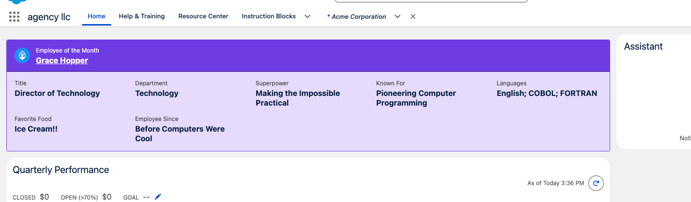
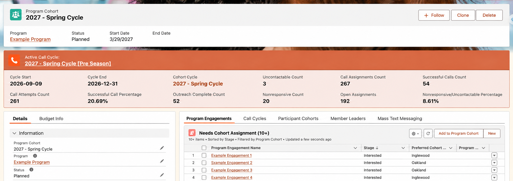
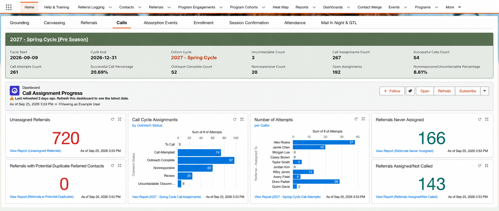
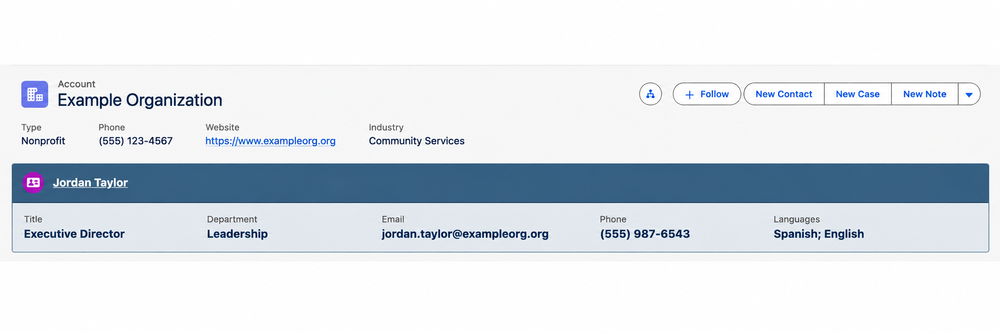
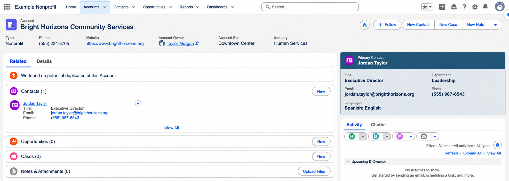

# Record Spotlight

A configurable Salesforce Lightning Web Component that surfaces the record that matters **right now**.

Choose the object, define what makes a record current, choose a Field Set, and place the component wherever users need the context.

No object-specific business logic is hard-coded into the component.

## See It in Action

Record Spotlight can surface the record that matters most wherever your users need it — including directly on a Home or App page, with no parent record required.

Here, Grace Hopper is getting the recognition she deserves. 💜



## Why Record Spotlight?

Salesforce's related-record patterns generally start with the record you're viewing and reach **up to a related parent record**.

Record Spotlight works differently. It finds the record that matters **right now**.

### Anywhere

On a Home Page or App Page, Record Spotlight can surface a current record with **no relationship or page record at all**.

For example:

- Employee of the Month
- Current fiscal year
- Active fundraising period
- Current program cycle
- Featured announcement record

### Down to a Child Record

On a Record Page, Record Spotlight can find the current **child record related to the record you're viewing**.

For example, a Program record could display its current Program Cycle rather than requiring users to navigate through a related list to find it.

That makes Record Spotlight useful when the important record isn't the record you're on — and isn't necessarily its parent.

## Examples

### Context-Aware Record Page

On a Record Page, Record Spotlight can find the current child record related to the record being viewed.



### Global App or Home Page

Leave **Parent Lookup Field** blank to surface the globally current record on an App Page or Home Page.



### Responsive Lightning Layouts

The component responds to the space Salesforce gives it — not the size of the browser window.

In a wider Lightning page region:



And in a narrow sidebar:



The same component automatically reflows its fields based on the space available. No separate layout or component configuration is required.

## What "Current" Means Is Up to You

The determining field can be any **Checkbox or Formula (Checkbox)**. It does not have to literally mean "current."

Use it for things like:

- Current program cycle
- Active contract
- Current fiscal period
- Primary contact
- Current grant period
- Active membership
- Current project phase
- Employee of the Month
- Featured record

For example, the component can use `Contact.Primary_Contact__c` on an Account page:

```text
Object API Name:
Contact

Parent Lookup Field:
AccountId

Checkbox Field That Determines Current Record:
Primary_Contact__c

Field Set to Display:
Primary_Contact_Display
```

The component then displays the Contact marked as Primary Contact for the Account being viewed.

## Features

- Standard and custom objects
- Home Pages, App Pages, and Record Pages
- Checkbox or Formula (Checkbox) determines the record
- Field Set determines the displayed fields and their order
- Optional parent-aware filtering on Record Pages
- Can surface child records rather than only parent records
- Global display requires no record relationship
- Clickable record navigation
- Text, number, currency, and percent formatting
- Salesforce formula hyperlinks
- Optional heading and Lightning icon
- Optional accent color with automatically generated body and divider colors
- Responsive field layout based on available component width
- Detects conflicting current records rather than choosing one arbitrarily
- No object-specific production logic

## Global vs. Parent-Aware

### Global

Leave **Parent Lookup Field** blank.

The component finds a record where:

```text
Current__c = TRUE
```

No page record or relationship is required.

This is useful on Home Pages and App Pages.

### Parent-Aware

On a Record Page, configure the lookup on the source object that points to the page record.

For example:

```text
Program_Cycle__c
WHERE Current__c = TRUE
AND Program__c = current Program
```

This allows each parent record to have its own current child record.

## Configuration

Add **Record Spotlight** in Lightning App Builder.

| Property | Required | Description |
|---|---|---|
| Object API Name | Yes | Object containing the record to display |
| Parent Lookup Field | No | Lookup or Master-Detail field pointing to the current Record Page record |
| Checkbox Field That Determines Current Record | Yes | Checkbox or Formula (Checkbox) identifying the record |
| Field Set to Display | Yes | Field Set containing the fields to display |
| Heading | No | Text above the clickable record name |
| Icon Name | No | Lightning icon such as `standard:event`, `standard:call`, or `standard:contact` |
| Accent Color | No | Hex color such as `#566B50` |

## Creating the Current Record Field

The component does not decide what "current" means. **Your Salesforce configuration does.**

A date-driven Formula (Checkbox) might be:

```text
AND(
    Start_Date__c <= TODAY(),
    End_Date__c >= TODAY()
)
```

> [!IMPORTANT]
> Your configuration must allow **only one record within the relevant scope** to evaluate to `TRUE`.
>
> This applies whether the determining field is a formula or a manually maintained checkbox. If more than one record evaluates to `TRUE`, Record Spotlight displays a configuration error instead of choosing a record arbitrarily.

For a global component, that means only one matching record across the configured object.

For a parent-aware component, each parent can have its own current record — but only one matching child record for that parent.

## Field Set

Create a Field Set on the configured object and add the fields you want displayed.

The Field Set controls:

- which fields appear
- the order in which they appear

Admins can therefore change the displayed information without modifying the LWC.

> **Note:** Rich Text Area fields are displayed as text rather than rendered HTML. Because their underlying HTML markup may be visible, Rich Text Area fields are not recommended for the display Field Set.

## Styling

### Heading

Optional text displayed above the clickable record name.

```text
Active Call Cycle:
```

### Icon

Use a valid Salesforce Lightning Design System icon name, for example:

```text
standard:call
standard:contact
standard:event
```

Leave blank for no icon.

### Accent Color

Enter a hex color such as:

```text
#566B50
```

The component automatically creates:

- the header and outline color
- a lighter body color
- a darker divider color
- readable light or dark header text

Leave blank for neutral styling.

## Responsive Layout

Lightning page regions can be much narrower than the browser itself.

Record Spotlight uses an intrinsic grid that responds to the **actual width available to the component**, allowing fields to reflow naturally in full-width regions, columns, and sidebars.

## Supported Field Display

Record Spotlight provides formatting for:

- Text
- Numbers
- Currency
- Percentages
- Salesforce formula hyperlinks

Other returned values fall back to text display.

## Formula Hyperlinks

Formula fields using Salesforce `HYPERLINK()` can be included in the Field Set and rendered as clickable links.

Example:

```text
HYPERLINK(
    "/" & Parent__c,
    Parent__r.Name,
    "_self"
)
```

## Installation

### Install the Released Package

Record Spotlight v1.0.0 is available as a released Salesforce unlocked package.

**Production / Developer Edition:**

https://login.salesforce.com/packaging/installPackage.apexp?p0=04tfj000000am1JAAQ

**Sandbox:**

https://test.salesforce.com/packaging/installPackage.apexp?p0=04tfj000000am1JAAQ

**Salesforce CLI:**

```bash
sf package install \
  --package 04tfj000000am1JAAQ \
  --target-org YOUR_ORG_ALIAS \
  --wait 30
```

### Deploy from Source

Clone or download this repository.

Authenticate the target Salesforce org with Salesforce CLI, then deploy:

```bash
sf project deploy start \
  --source-dir force-app/main/default \
  --target-org YOUR_ORG_ALIAS \
  --test-level RunSpecifiedTests \
  --tests RecordSpotlightController_Test \
  --wait 30
```

## Permissions

Users need access to:

- the configured source object
- the current-record checkbox field
- fields included in the Field Set
- the parent lookup field when parent-aware filtering is used
- `RecordSpotlightController`

The included `Record_Spotlight` Permission Set provides Apex Class Access to the Record Spotlight controller.

Normal Salesforce object and field security still applies to the records and fields configured for display.

## Package Contents

The released package includes:

- `recordSpotlight` — Lightning Web Component
- `RecordSpotlightController` — Apex controller
- `RecordSpotlightController_Test` — Apex test coverage
- `Record_Spotlight` — Permission Set
- `Contact.Agency_Package_Test` — shared Field Set used by packaged Apex tests
- `Contact.Agency_Package_Test_Current__c` — shared Checkbox used by packaged Apex tests

### Test Metadata

The Contact Field Set and checkbox are test fixtures required for package creation and validation.

They are **not used by Record Spotlight at runtime** and should not be deleted from an installed package.

During 2GP package-version creation, the project uses `apexTestAccess` to assign the `Record_Spotlight` Permission Set to the package-build test user. This provides the field access required by the packaged Apex tests.

## Troubleshooting

### No current record appears

Verify:

1. Object API Name is correct.
2. The determining field exists and is a Checkbox or Formula (Checkbox).
3. A record evaluates to `TRUE`.
4. The running user has access to the configured metadata.

### Multiple current records found

More than one record is evaluating to `TRUE` within the same scope.

If the current-record field is a **formula**, check the formula logic and the underlying data to make sure the valid periods or conditions cannot overlap.

If the field is a **manually maintained checkbox**, make sure the process for marking a new record current also clears the previous current record.

The component deliberately refuses to choose between multiple matches because doing so could display incorrect information.

### Wrong record appears on a Record Page

If "current" should be specific to the page record, configure **Parent Lookup Field**.

### Nothing appears after adding Parent Lookup Field

Verify that:

- the component is on a Record Page
- the field is a Lookup or Master-Detail field
- the lookup points to the page record
- a related record evaluates to `TRUE`

### Icon doesn't appear

Use a valid Lightning Design System icon name including its category, such as:

```text
standard:event
```

## Architecture

```text
Lightning Page
      ↓
recordSpotlight
      ↓
Imperative Apex Request
      ↓
RecordSpotlightController
      ↓
Dynamic Schema Validation
      ↓
Dynamic SOQL
      ↓
0 matches → No current record
1 match   → Display record
2 matches → Configuration error
      ↓
Current Record + Field Set Metadata
      ↓
Responsive Spotlight
```

The LWC loads the record imperatively so both Record Page context and global Home/App Page use work reliably.

The Apex controller validates the configured object, checkbox, Field Set, and optional parent lookup before constructing the query. A configured parent field must be a Salesforce `REFERENCE` field.

The query retrieves at most two matching records. This is enough to distinguish between no current record, exactly one current record, and an invalid configuration containing multiple current records.

## Project Structure

```text
force-app/main/default/
├── classes/
│   ├── RecordSpotlightController.cls
│   ├── RecordSpotlightController.cls-meta.xml
│   ├── RecordSpotlightController_Test.cls
│   └── RecordSpotlightController_Test.cls-meta.xml
├── lwc/
│   └── recordSpotlight/
│       ├── recordSpotlight.css
│       ├── recordSpotlight.html
│       ├── recordSpotlight.js
│       └── recordSpotlight.js-meta.xml
├── objects/
│   └── Contact/
│       ├── fieldSets/
│       │   └── Agency_Package_Test.fieldSet-meta.xml
│       └── fields/
│           └── Agency_Package_Test_Current__c.field-meta.xml
└── permissionsets/
    └── Record_Spotlight.permissionset-meta.xml
```

## Compatibility

Built with Salesforce API Version **67.0** for Lightning Experience.

The source has been successfully deployed and tested across unrelated Salesforce orgs.

Record Spotlight v1.0.0 has also been built as a Salesforce second-generation unlocked package, installed into an unrelated sandbox, functionally tested there, and promoted as a released package version.

## Design Philosophy

Record Spotlight separates three questions:

**Which record matters?**  
Your Checkbox or Formula (Checkbox) decides.

**Which fields matter?**  
Your Field Set decides.

**Where does it matter?**  
Lightning App Builder decides.

The component just brings those decisions together.

## License

Released under the MIT License. See `LICENSE`.

## Author

Created by **mandie mcdougal**  
**agency llc**

**Empowered. By Design.**